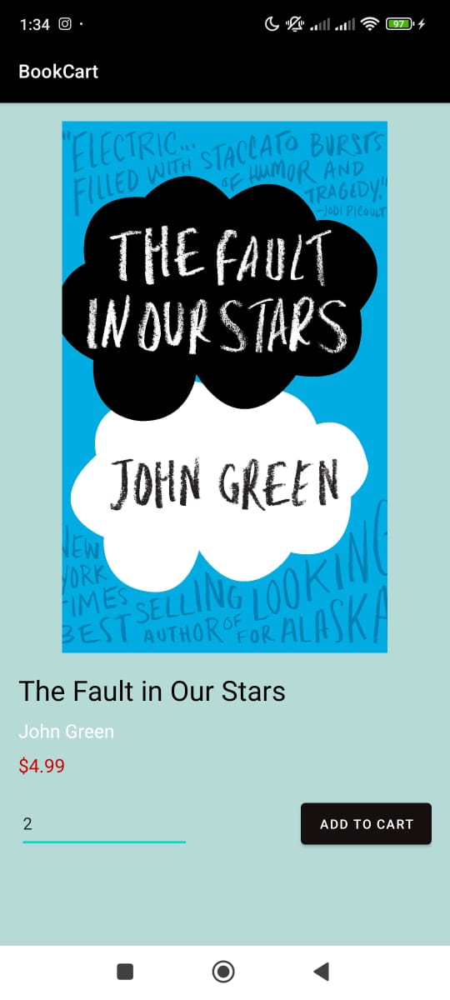

# Book Cart Application

The Book Cart Application is a comprehensive e-commerce platform designed for book enthusiasts. Developed in Java and XML on Android Studio, this app provides a seamless shopping experience with features such as registration, login, browsing, searching, cart management, and order history.

## Features
### 1. Registration Page
The registration page allows new users to sign up, providing essential details to create a personalized account.

### 2. Login Page
The login page enables users to securely access their accounts by providing their email and password. Credentials are verified against the database, and successful authentication grants access to the application.

### 3. Home Page
The home page displays a collection of books using a RecyclerView in a card-based layout, showcasing each book's title and image. Users can scroll through the collection and select individual books to view more details.

### 4. Detail Page
The detail page offers comprehensive information about each selected book. Users can view detailed descriptions and add books to their cart.

### 5. Search Page
The search page allows users to find specific books quickly. The type-ahead search bar enables users to search for books by title or keyword.

### 6. Cart Page
The cart page displays items added by the user. It shows product details, quantity, total cost, and includes a Checkout button. The cart functionality is built using Cart Manager and Cart Adapter Java classes.

### 7. Checkout Page
The checkout page collects the user’s shipping information, including Full Name, Address, Phone Number, and Email. An Intent() function is used to carry this information forward in the app.

### 8. Purchase History
The purchase history page records the user's past orders over the last six months. Using card views, it displays an order list with item details, quantities, order status, and order IDs.

### 9. Animation Activity
The animation activity presents an introductory screen with a delay before showing the "Book Cart" text. This activity is displayed when the app is launched.

### 10. Menu
The menu provides access to different sections of the app, including:

The Book Cart application is a fully featured e-commerce app for book lovers. Developed with Android Studio, it provides an engaging and user-friendly platform for discovering, purchasing, and managing book orders.

## Project Screenshots

Here are some screenshots showcasing the Sign Hope application in action:

    
    
    

    
    
    

